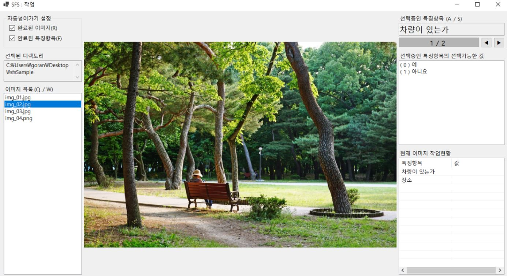
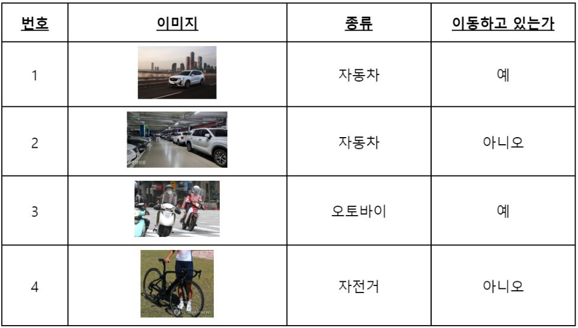

# SFS

> Super Fast Selection

SFS는 소규모의 데이터 분류를 위한 도구입니다.
이미지 특징항목의 선택에 특화되었습니다.

### Version

- .NET framework : 5.0
- C# : 9.0 (.NET 5.0의 기본값)
- IDE : Visual Studio Community 2022

### SFS를 사용할 수 있는 구체적인 상황

아래의 과정들을 SFS를 사용하면 빠르게 수행할 수 있다.

- 가정 : 아래의 분류기준에 따라 운송수단 데이터셋을 분류한다.

|    특징항목     |            값            |
| :-------------: | :----------------------: |
|      종류       | 자동차, 오토바이, 자전거 |
| 이동하고 있는가 |        예, 아니오        |

- 문제 : 아래 4개 이미지를 위 분류기준에 따라 분류한다.

- 해결 : 아래와 같이 각 이미지의 특징항목에 대한 값을 선택한다.

# 디렉토리 구성

- `source_code` : 모든 소스코드와 빌드 결과(Debug, Release)를 포함하는 디렉토리입니다.
- `program` : Release 빌드 산출물만을 모아놓은 디렉토리로, 실제로 실행할 수 있는 .exe확장자의 프로그램을 포함합니다.
- `sample_image_and_config` : SFS프로그램의 첫 구동시 테스트 용도로 사용할 수 있는 이미지와 설정파일을 포함하는 디렉토리입니다.

# 작업 시작하기

### 샘플데이터를 사용해 시작하기

참조 영상 : [LINK](https://youtu.be/QN5HU69spx8)

1. `program`폴더 안의 `.exe`로 끝나는 파일을 실행하여 메인화면을 표시합니다.
2. 작업대상 디렉토리를 `sample_image_and_config`폴더로 지정합니다.
3. 설정파일 경로를 `sample_image_and_config/sample_config.sfs`로 지정합니다.
4. **`작업시작`** 버튼을 클릭합니다.

### 처음부터 시작하기

참조 영상 : [LINK](https://www.youtube.com/watch?v=S_sO1oor4F8)

1. `program`폴더 안의 `.exe`로 끝나는 파일을 실행하여 메인화면을 표시합니다.
2. **`설정파일 만들기`** 버튼을 클릭해 `.sfs`로 끝나는 설정파일을 생성합니다.
3. 작업대상 디렉토리와 설정파일 경로를 지정합니다.
4. **`작업시작`** 버튼을 클릭합니다.

# 작업 진행하기

참조 영상 : [LINK](https://youtu.be/tMm4sxRI5zQ)

### 구성요소

- 자동 넘어가기 설정
  - 완료된 이미지 : **< 토글 : `R` >** 현재 이미지의 모든 특징항목이 선택완료되었으면 다음 이미지로 넘어갑니다. 만약 이전 이미지로 넘어간 경우 자동으로 설정이 해제됩니다.
  - 완료된 특징항목 : **< 토글 : `F` >** 현재 특징항목이 선택완료되었으면 다음 특징항목으로 넘어갑니다. 만약 이전 특징항목으로 넘어간 경우 자동으로 설정이 해제됩니다.
- 선택된 디렉토리 : 현재 선택된 디렉토리를 표시합니다.
- 이미지 목록 :
  - **< 이전 이미지 선택 : `Q` / 다음 이미지 선택 : `W` / 특정 이미지 선택 : `클릭` >**
  - 선택한 디렉토리 내 모든 이미지의 목록을 표시합니다. 파란색으로 표시된 이미지가 프로그램 가운데에 표시됩니다. 키보드 QW 또는 클릭으로 다른 이미지를 선택할 수 있습니다.
- 선택중인 특징항목 :
  - **< 이전 특징항목 선택 : `A`또는 `◀클릭` / 다음 특징항목 선택 : `S`또는 `▶클릭`>**
  - 현재 이미지에 대해 어떤 특징항목을 선택중인지 표시합니다.
- 선택가능한 값
  - **< 값 선택 : 키패드 숫자 `0`~`9` 또는 `클릭` >**
  - 현재 선택된 특징항목에 대해 선택가능한 값을 표시합니다.
- 현재 이미지 작업 현황 : 현재 이미지에 대한 작업상태를 표시합니다.
